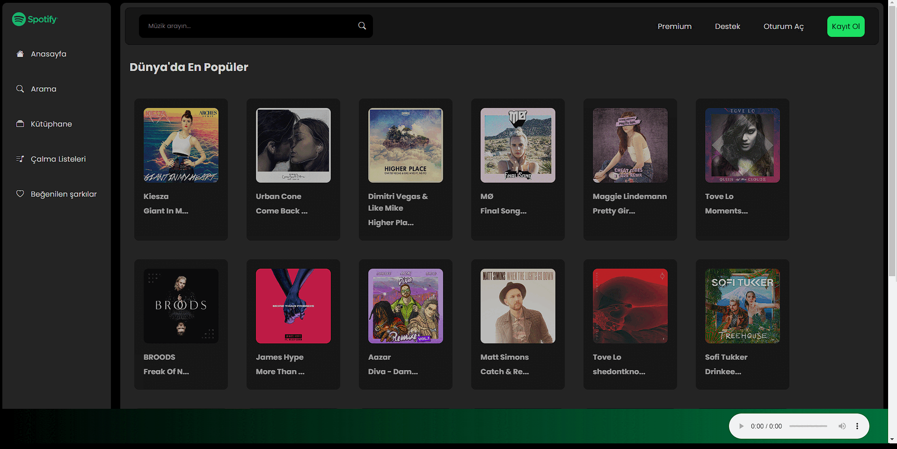

# Spotify Clone Application

## Description

This is a web application developed using JavaScript to clone the Spotify interface.

## Technologies Used

- HTML
- CSS
- JavaScript

## How to Use

1. Clone the repository:
   ```bash
   https://github.com/KamilErdogmus/Spotify-Clone.git
   ```
2. Open the index.html file in your browser

# GIF



# Link

[Website](https://6654b6d95fdd49494e49cbe3--incomparable-gecko-905f69.netlify.app/)

